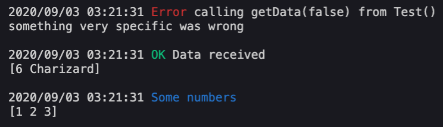

# go-custom-logger

Go-custom-logger provides some helpers for quick debugging using stdout. Handy functions that formats a given data and label to the output and helpers simplifying the usage of colors.

## Demo

### Input

```go
package main

import "github.com/gregoryalbouy/go-custom-logger"

func main() {
    data, err := getData(...)
	if err != nil {
		clog.Error(err, "calling getData(false) from Test()")
		return
    }
    
    clog.Ok(data, "Data received")
    
    clog.Printlb([]int{1, 2, 3}, clog.Blue("Some numbers"))
}

func getData(success bool) ([]interface{}, error) {
	if !success {
		return nil, errors.New("something very specific was wrong")
    }
    
	return []interface{}{6, "Charizard"}, nil
}
```

### Output

